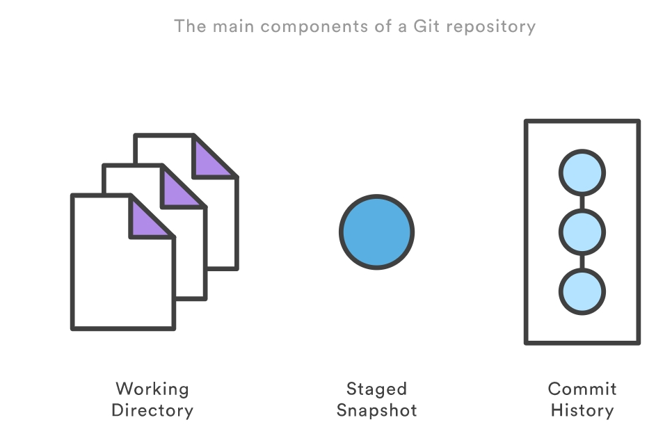

## 1. Git仓库的状态？




如图：Git仓库大体有三个状态，工作目录(Working Directory)、缓存区快照(Staged Snapshot)、提交历史(Commit History)。

## 2. 对git revert的理解和使用场景？

### 2.1 理解

git revert操作针对的是commit提交历史，而且如果进行此操作时，有没提交(commit)的文件的话会报错。

* 如果当前仓库有没有添加到缓存区(Staged Snapshot)的文件（即没有git add），则会提示下面错误：

```shell
$ git revert HEAD
error: Your local changes to the following files would be overwritten by merge:
        readme.md
Please commit your changes or stash them before you merge.
Aborting
fatal: revert failed
```

* 如果没有进行提交(即没有git commit)，则会提示下面错误：

```
$ git revert HEAD
error: your local changes would be overwritten by revert.
hint: commit your changes or stash them to proceed.
fatal: revert failed
```

进行`git revert`操作可能会有冲突，需要你合并一下代码，操作的结果是增加了一次commit历史。

git revert命令只能撤销最新的一次提交(commit)，如果想撤销多个提交，必须在命令行依次指定这些提交。比如，撤销前两个提交，要像下面这样写。

```
git revert [倒数第一个提交] [倒数第二个提交]
```

### 2.2 使用场景

1）撤销当前提交

当你提交(commit)了代码之后，发现本次提交(比如，commit id为5e1897f111)的代码有问题，你想撤销掉本次commit，这是执行下面操作就可以了。

```
# 撤销当前提交
$ git revert HEAD
```

这个操作会在当前提交(commit id为5e1897f111)之后，新增一次提交(commit id为5e1897f222)，当前提交(commit id为5e1897f111)的内容仍会保留在提交历史当中，但是代码回到上次提交((commit id为5e1897f000)的版本了。

2）撤销指定提交

```
# 撤销某次提交
$ git revert some_commit_id
```

这个操作会将当前版本，直接回到指定提交ID的上一次提交的版本历史。

`git revert`不会改变过去的历史，没有任何丢失代码的风险。

## 3. git reset操作的使用

`git reset`操作可以用来操作工作目录(Working Directory)、缓存区快照(Staged Snapshot)、提交历史(Commit History)。但是需要注意的是：*操作提交历史的话，重置的提交历史是无法恢复的* 。

因此，`git reset`命令通常被用来重置缓存区快照和工作目录的修改。这个命令应该只用于下面的本地修改的情形(切记：不要用它来操作于他人共享的提交历史)：

* 删除缓存区快照；
* 当前工作目录；
* 尚未push到远程分支的commit提交历史；

>执行git reset命令之后，如果想找回那些丢弃掉的提交，可以使用git reflog命令，具体做法参考这里。不过，这种做法有时效性，时间长了可能找不回来。

`git reset`根据不同的参数会有不同的效果，使用情况示例：

**1)将指定文件从缓存区快照移除，但不改变工作目录内容，即将文件取消`git add`操作:**

```
git reset <file>
```

这个操作只会撤销指定文件的`git add`操作，本地该文件的内容不会变。

**2)将文件从缓存区移除，但不改变工作目录内容，即将所有执行了`git add`的文件从缓存快照区移出:**

```
git reset
```

这个操作只会将撤销`git add`的所有内容，本地文件的内容不会变。

**3)重置工作目录和缓存区**

```
git reset --hard
```

注： 这个就要小心了，因为此操作会重置工作目录和缓存区快照，而且是使用最近的一次提交(HEAD)历史来重置。所以不管你执行`git add`没有，只要你没有执行`git commit`的所有更改(包括工作目录、缓存区快照)都被重置为上次提交历史的版本。

**4)删除提交历史**

```
git reset <commit>
```

删除了`<commit>`之后的提交历史，仅保留`<commit>`和`<commit>`之前的提交历史。工作目录的内容保持不变，缓存区快照会被删除。

**5)删除提交历史并重置工作目录和缓存区**

```
git reset --hard <commit>
```

删除了`<commit>`之后的提交历史，工作目录和缓存区快照都重置到`<commit>`这次提交的状态。

## 4.`git revert`和`git reset`的区别？

撤销(revert)被设计为撤销公开的提交（比如已经push）的安全方式，`git reset`被设计为重置本地更改。因为两个命令的目的不同，它们的实现也不一样：重置完全地移除了一堆更改，而撤销保留了原来的更改，用一个新的提交来实现撤销。

## 5.如何撤销Git操作？

https://www.ddmit.com/2019/12/25/git-undo/ ;