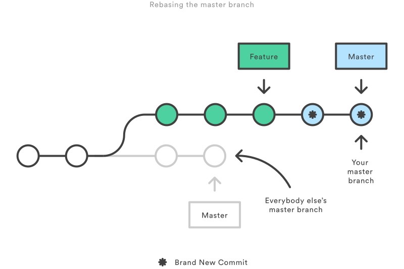

## 1. Git仓库的状态？


如图：Git仓库大体有三个状态，工作目录(Working Directory)、缓存区快照(Staged Snapshot)、提交历史(Commit History)。

## 2. 对git revert的理解和使用场景？

### 2.1 理解

`git revert`操作针对的是commit提交历史，而且如果进行此操作时，有没提交(commit)的文件的话会报错。

* 如果当前仓库有没有添加到缓存区(Staged Snapshot)的文件（即没有git add），则会提示下面错误：

```shell
$ git revert HEAD
error: Your local changes to the following files would be overwritten by merge:
        readme.md
Please commit your changes or stash them before you merge.
Aborting
fatal: revert failed
```

* 如果没有进行提交(即没有git commit)，则会提示下面错误：

```
$ git revert HEAD
error: your local changes would be overwritten by revert.
hint: commit your changes or stash them to proceed.
fatal: revert failed
```

进行`git revert`操作可能会有冲突，需要你合并一下代码，操作的结果是增加了一次commit历史。

`git revert`命令只能撤销最新的一次提交(commit)，也就是将指定`commit id`的提交撤销回该次提交的上一个版本；如果想撤销多个提交，必须在命令行依次指定这些提交。比如，撤销前两个提交，要像下面这样写。

```
git revert [倒数第一个提交] [倒数第二个提交]
```

### 2.2 使用场景

1）撤销当前提交

当你提交(commit)了代码之后，发现本次提交(比如，commit id为5e1897f111)的代码有问题，你想撤销掉本次commit，这是执行下面操作就可以了。

```
# 撤销当前提交
$ git revert HEAD
```

这个操作会在当前提交(commit id为5e1897f111)之后，新增一次提交(commit id为5e1897f222)，当前提交(commit id为5e1897f111)的内容仍会保留在提交历史当中，但是代码回到上次提交(commit id为5e1897f000)的版本了。

2）撤销指定提交

```
# 撤销某次提交
$ git revert some_commit_id
```

这个操作会将当前版本，直接回到指定提交ID的上一次提交的版本历史，操作过程中，可能会存在冲突，合并冲突即可。

`git revert`不会改变过去的历史，没有任何丢失代码的风险。

## 3. git reset操作的使用

`git reset`操作可以用来操作工作目录(Working Directory)、缓存区快照(Staged Snapshot)、提交历史(Commit History)。但是需要注意的是：***操作提交历史的话，重置的提交历史是无法恢复的*** 。

因此，`git reset`命令通常被用来重置缓存区快照和工作目录的修改。这个命令应该只用于下面的本地修改的情形(切记：不要用它来操作于他人共享的提交历史)：

* 删除缓存区快照；
* 当前工作目录；
* 尚未push到远程分支的commit提交历史；

>执行git reset命令之后，如果想找回那些丢弃掉的提交，可以使用git reflog命令，具体做法参考[这里](https://github.blog/2015-06-08-how-to-undo-almost-anything-with-git/#redo-after-undo-local)。不过，这种做法有时效性，时间长了可能找不回来。

`git reset`根据不同的参数会有不同的效果，使用情况示例：

**1)将指定文件从缓存区快照移除，但不改变工作目录内容，即将文件取消`git add`操作:**

```
git reset <file>
```

这个操作只会撤销指定文件的`git add`操作，本地该文件的内容不会变。

**2)将文件从缓存区移除，但不改变工作目录内容，即将所有执行了`git add`的文件从缓存快照区移出:**

```
git reset
```

这个操作只会将撤销`git add`的所有内容，本地文件的内容不会变。

**3)重置工作目录和缓存区**

```
git reset --hard
```

注： 这个就要小心了，因为此操作会重置工作目录和缓存区快照，而且是使用最近的一次提交(HEAD)历史来重置。所以不管你执行`git add`没有，只要你没有执行`git commit`的所有更改(包括工作目录、缓存区快照)都被重置为上次提交历史的版本。

**4)删除提交历史**

```
git reset <commit>
```

删除了`<commit>`之后的提交历史，仅保留`<commit>`和`<commit>`之前的提交历史。工作目录的内容保持不变，缓存区快照会被删除。

**5)删除提交历史并重置工作目录和缓存区**

```
git reset --hard <commit>
```

删除了`<commit>`之后的提交历史，工作目录和缓存区快照都重置到`<commit>`这次提交的状态。

## 4.`git revert`和`git reset`的区别？

撤销(revert)被设计为撤销公开的提交（比如已经push）的安全方式，`git reset`被设计为重置本地更改。因为两个命令的目的不同，它们的实现也不一样：重置完全地移除了一堆更改，而撤销保留了原来的更改，用一个新的提交来实现撤销。

## 5.如何撤销Git操作？

https://www.ddmit.com/2019/12/25/git-undo/ ;

### 5.1 撤销提交(git revert)

针对`commit history`进行操作，将指定的提交历史对应变化，还原至该提交历史的上一个版本。比如`git revert HEAD`操作，就是将最新的提交历史回滚到上一个版本。注意：revert操作只会对指定的提交历史起作用，比如这里的`HEAD`版本，如果你要对多个提交历史的内容变化进行回滚，需要指定多个提交历史：如下：

```
git revert [commit_id_1] [commit_id_2]
```

这种提交，是在原提交历史的基础上，增加了新的提交历史，不会造成代码丢失的风险。

`git revert`命令还有两个参数。

```
--no-edit：执行时不打开默认编辑器，直接使用 Git 自动生成的提交信息。
--no-commit：只抵消暂存区和工作区的文件变化，不产生新的提交。
```

### 5.2 重置/丢弃提交(git reset)

默认情况下，`git reset`不改变工作区的文件（但会改变暂存区），`--hard`参数可以让工作区里面的文件也回到以前的状态。

```
$ git reset [last good SHA]
```

上面的命令，操作的是提交历史，会删除了`[last good SHA]`之后的提交历史，仅保留`[last good SHA]`和`[last good SHA]`之前的提交历史。工作目录的内容保持不变，缓存区快照会被删除。

细节见：3. git reset操作的使用。

### 5.3 替换上一次提交(git commit --amend)

提交以后，发现提交信息写错了，这时可以使用`git commit`命令的`--amend`参数，可以修改上一次的提交信息。

```
$ git commit --amend -m "Fixes bug #42"
```

这时如果暂存区有发生变化的文件，会一起提交到仓库。所以，`--amend`不仅可以修改提交信息，还可以整个把上一次提交替换掉。

### 5.4 撤销工作区文件修改

如果工作区的某个文件被改乱了，但还没有提交(`git commit`)，可以用`git checkout`命令找回本次修改之前的文件。

```
$ git checkout -- [filename]
```

这个操作可能会在暂存区进行文件恢复，也可能是从上次的提交历史恢复文件。原理是：

**先找暂存区，如果该文件有暂存的版本，则恢复该版本，否则恢复上一次提交的版本**。

### 5.5 撤销暂存区操作(撤销`git add`操作)

如果不小心把一个文件添加到暂存区，可以用下面的命令撤销：

```
$ git rm --cached [filename]
```

上面的命令不影响已经提交的内容。

### 5.6撤销当前分支

本来在另一个分支进行操作的修改，发现在当前分支进行了修改，你想将这些修改转移到另一个分支，撤销在当前分支进行的修改。

```
# 新建一个 feature 分支，指向当前最新的提交
# 注意，这时依然停留在当前分支
$ git branch feature

# 切换到这几次提交之前的状态
$ git reset --hard [当前分支此前的最后一次提交]

# 切换到 feature 分支
$ git checkout feature
```

上面的操作等于是撤销当前分支的变化，将这些变化放到一个新建的分支。

## 6.Merging vs. Rebasing

`git rebase` 这个命令经常被人认为是一种 Git 巫术，初学者应该避而远之。但如果使用得当的话，它能给你的团队开发省去太多烦恼。在这篇文章中，我们会比较 `git rebase` 和类似的 `git merge` 命令，找到 Git 工作流中 rebase 的所有用法。

### 6.1 概述

你要知道的第一件事是，`git rebase` 和`git merge` 做的事其实是一样的。它们都被设计来将一个分支的更改并入另一个分支，只不过方式有些不同。

想象一下，你刚创建了一个专门的分支开发新功能，然后团队中另一个成员在 master 分支上添加了新的提交。这就会造成提交历史被 fork 一份，用 Git 来协作的开发者应该都很清楚。


现在，如果 master 中新的提交和你的工作是相关的。为了将新的提交并入你的分支，你有两个选择：`merge` 或 `rebase`。

#### 6.1.2 Merge

将 master 分支合并到 feature 分支最简单的办法就是用下面这些命令：

```
git checkout feature
git merge master
```

或者，你也可以把它们压缩在一行里。

```
git merge master feature
```

feature 分支中新的合并提交（merge commit）将两个分支的历史连在了一起。你会得到下面这样的分支结构：


Merge 好在它是一个安全的操作。现有的分支不会被更改，避免了 rebase 潜在的缺点（后面会说）。

另一方面，这同样意味着每次合并上游更改时 feature 分支都会引入一个外来的合并提交。如果 master 非常活跃的话，这或多或少会污染你的分支历史。虽然高级的 `git log` 选项可以减轻这个问题，但对于开发者来说，还是会增加理解项目历史的难度。

#### 6.1.3 Rebase

作为 merge 的替代选择，你可以像下面这样将 feature 分支并入 master 分支：

```
git checkout feature
git rebase master
```

它会把整个 feature 分支移动到 master 分支的后面，有效地把所有 master 分支上新的提交并入过来。但是，rebase 为原分支上每一个提交创建一个新的提交，重写了项目历史，并且不会带来合并提交。


rebase最大的好处是你的项目历史会非常整洁。首先，它不像 `git merge` 那样引入不必要的合并提交。其次，如上图所示，rebase 导致最后的项目历史呈现出完美的线性——你可以从项目终点到起点浏览而不需要任何的 fork。这让你更容易使用 `git log`、`git bisect` 和 `gitk` 来查看项目历史。

不过，这种简单的提交历史会带来两个后果：安全性和可跟踪性。如果你违反了 rebase 黄金法则，重写项目历史可能会给你的协作工作流带来灾难性的影响。此外，rebase 不会有合并提交中附带的信息——你看不到 feature 分支中并入了上游的哪些更改。

#### 6.1.4 交互式的 rebase

交互式的 rebase 允许你更改并入新分支的提交。这比自动的 rebase 更加强大，因为它提供了对分支上提交历史完整的控制。一般来说，这被用于将 feature 分支并入 master 分支之前，清理混乱的历史。

把 `-i` 传入 `git rebase` 选项来开始一个交互式的rebase过程：

```
git checkout feature
git rebase -i master
```

它会打开一个文本编辑器，显示所有将被移动的提交：

```
pick 33d5b7a Message for commit #1
pick 9480b3d Message for commit #2
pick 5c67e61 Message for commit #3
```

这个列表定义了 rebase 将被执行后分支会是什么样的。更改 `pick` 命令或者重新排序，这个分支的历史就能如你所愿了。比如说，如果第二个提交修复了第一个提交中的小问题，你可以用 `fixup` 命令把它们合到一个提交中：

```
pick 33d5b7a Message for commit #1
fixup 9480b3d Message for commit #2
pick 5c67e61 Message for commit #3
```

保存后关闭文件，Git 会根据你的指令来执行 rebase，项目历史看上去会是这样：


忽略不重要的提交会让你的 feature 分支的历史更清晰易读。这是 `git merge` 做不到的。

### 6.2 Rebase的黄金法则

当你理解 rebase 是什么的时候，最重要的就是什么时候 *不能* 用 rebase。`git rebase` 的黄金法则便是，绝不要在公共的分支上使用它。

比如说，如果你把 master 分支 rebase 到你的 feature 分支上会发生什么：



这次 rebase 将 master 分支上的所有提交都移到了 feature 分支后面。问题是它只发生在你的代码仓库中，其他所有的开发者还在原来的 master 上工作。因为 rebase 引起了新的提交，Git 会认为你的 master 分支和其他人的 master 已经分叉了。

同步两个 master 分支的唯一办法是把它们 merge 到一起，导致一个额外的合并提交和两堆包含同样更改的提交。不用说，这会让人非常困惑。

所以，在你运行 `git rebase` 之前，一定要问问你自己「有没有别人正在这个分支上工作？」。如果答案是肯定的，那么把你的爪子放回去，重新找到一个无害的方式（如 `git revert`）来提交你的更改。不然的话，你可以随心所欲地重写历史。

#### 6.2.1 强制推送

如果你想把 rebase 之后的 master 分支推送到远程仓库，Git 会阻止你这么做，因为两个分支包含冲突。但你可以传入 `--force` 标记来强行推送。就像下面一样：

```
# 小心使用这个命令！
git push --force
```

它会重写远程的 master 分支来匹配你仓库中 rebase 之后的 master 分支，对于团队中其他成员来说这看上去很诡异。所以，务必小心这个命令，只有当你知道你在做什么的时候再使用。

仅有的几个强制推送的使用场景之一是，当你在想向远程仓库推送了一个私有分支之后，执行了一个本地的清理（比如说为了回滚）。这就像是在说「哦，其实我并不想推送之前那个 feature 分支的。用我现在的版本替换掉吧。」同样，你要注意没有别人正在这个 feature 分支上工作。

参考：[Merging vs. Rebasing](https://www.atlassian.com/git/tutorials/merging-vs-rebasing)；