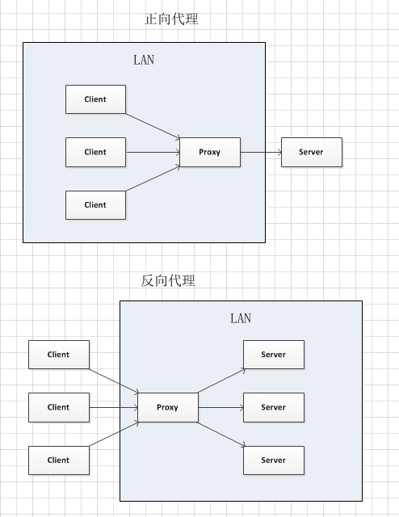

## 1.NGINX正向代理与反向代理？

### 1.1 代理的概念的理解

在Java设计模式中，代理模式是这样定义的：给某个对象提供一个代理对象，并由代理对象控制原对象的引用。

代理简单来说，就是如果我们想做什么，但又不想直接去做，那么这时候就找另外一个人帮我们去做。例如现实生活中的房产中介，我们就可以委托中介公司来给我们找合适的房子，以及后续的质量检测过户等操作，我们只需要选好自己想要的房子，然后交钱就行了。

### 1.2 正向代理的定义？

正向代理服务器位于客户端和目标服务器之间，客户端要向代理服务器发送一个请求，并指定目标服务器，代理服务器将目标服务器返回的数据转交给客户端。这里客户端是要进行一些正向代理的设置的。

### 1.3 反向代理的定义？

反向代理服务器是目标服务器暴露给客户端的一个中间代理。反向代理服务器和目标服务器对外就是一个服务器，暴露的是代理服务器地址，隐藏了真实服务器IP地址。客户端不需要任何配置，客户端将请求发送给反向代理服务器，由反向代理服务器去选择一个目标服务器(可能多个)获取数据后，在返回给客户端。反向代理，对于客户端是无感知的。

### 1.4 NGINX正向代理和反向代理的区别？

从一张图(来自知乎网友@阿笠硕士)，看NGINX正向代理和反向代理的区别。



反向代理和正向代理的区别就是：正向代理代理客户端，反向代理代理服务器。

参考：
https://www.cnblogs.com/anker/p/6056540.html ；


### 1.5 正向代理和反向代理的配置示例

**正向代理**

正向代理的使用，就是你指定什么地址，代理服务器就将这个地址交给目标服务器。

```
location / {
    root /usr/local/html;
    index index.html index.htm;
}
```

比如你访问`http://192.168.1.115/test.html`，代理服务器就去目标服务器找这个路径的文件。


**反向代理**

这里以使用nginx upstream实现负载均衡为例。比如有三台服务器，各台机器的配置不一致，可以通过这种方式控制访问各台服务器的权重。

```
http {

    ...略去其他配置

    upstream gateway {
        server 10.200.67.27:8030 weight=3;
        server 10.200.67.29:8030 weight=3;
        server 10.200.67.30:8030 weight=4;
    }

    server {
        listen       8083;

        ...略去其他配置

        location /prod-api/{
            proxy_set_header Host $http_host;
            proxy_set_header X-Real-IP $remote_addr;
            proxy_set_header REMOTE-HOST $remote_addr;
            proxy_set_header X-Forwarded-For $proxy_add_x_forwarded_for;
            proxy_pass http://gateway/;
        }
    }

}
```

上面upstream定义了一组服务器，他们可以是不同的端口。