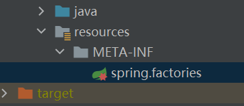

## 1.多模块项目：`@Autowired`无法注入其他模块原因及解决办法？

场景：在多模块项目的开发中，其中一个模块，想通过`@Autowired`注入其他模块的依赖，但是会提示注入失败。

### 解决办法

**方式一**

比如我的gateway模块，想引用auth模块的依赖，启动后会报错。解决办法之一是修改启动类：

```
@EnableEurekaClient
@EnableZuulProxy
@SpringBootApplication
public class DashGatewayApplication {

    public static void main(String[] args) {
        SpringApplication.run(DashGatewayApplication.class, args);
    }

}
```

修改为：

```
@SpringBootApplication(scanBasePackages = {"com.ddmit.gateway", "com.ddmit.auth"})
```

**方式二**

除了这种修改方式，还可以通过`spring-factories`文件方式进行注入：



```
org.springframework.boot.autoconfigure.EnableAutoConfiguration=\
  com.ddmit.common.security.service.TokenService
```

### 原因

无法注入的原因是：`@ComponentScan`注解默认的扫描范围是当前类所在包及其子包，多模块不在扫描范围内。


参考：

1） [基于SpringBoot的多模块项目引入其他模块时@Autowired无法注入其他模块stereotype注解类对象的问题解决](https://blog.51cto.com/u_15077548/4093447);


## 2. `@SpringBootApplication`默认扫描范围？

`@SpringBootApplication`是一个组合注解，包括：`@SpringBootConfiguration`、`@EnableAutoConfiguration`、`@ComponentScan`。

三个注解的作用：

* `@SpringBootConfiguration`继承自`@Configuration`，二者功能也一致，标注当前类是配置类，
  并会将当前类内声明的一个或多个以`@Bean`注解标记的方法的实例纳入到spring容器中，并且实例名就是该方法的方法名。`@SpringBootConfiguration` 可以作为 Spring 标准中`@Configuration` 注解的替代。
* `@EnableAutoConfiguration` 注解表示开启自动配置功能，该注解是 Spring Boot 框架最重要的注解，也是实现自动化配置的注解。通常建议将 `@EnableAutoConfiguration`（如果您未使用 `@SpringBootApplication`）放在根包中，以便可以搜索所有子包和类。`@EnableAutoConfiguration`可以帮助Spring Boot应用将所有符合条件的`@Configuration`配置都加载到当前Spring Boot创建并使用的IoC容器。
* `@ComponentScan`注解的作用主要是定义扫描的包路径，然后从中找出标识了需要装配的类自动装配到Spring的Bean容器。默认扫描范围为：所在包及其子包。

参考：

1）[@springBootApplication的默认扫描范围](https://blog.csdn.net/swansonge/article/details/106259937)；

2）[@ComponentScan 注解（1）](https://www.hxstrive.com/subject/spring_boot.htm?id=327);

## 3.spring-factories文件的加载时机

### 3.1 Spring Factories实现原理

`spring-factories`原理：一种类似于Java SPI(Service Provider Interface)机制的服务发现机制，通过在`META-INF/spring.factories`文件中配置接口的**实现类**名称，然后在程序中读取这些配置文件并实例化。这种自定义的SPI机制是Spring Boot Starter实现的基础。

`spring-core`包里定义了`SpringFactoriesLoader`类，这个类实现了检索`META-INF/spring.factories`文件，并获取指定接口的配置的功能。在这个类中定义了两个对外的方法：

* `loadFactories`：根据接口类获取其实现类的实例，这个方法返回的是对象列表。

* `loadFactoryNames`：根据接口获取其接口类的名称，这个方法返回的是类名的列表。

上面的两个方法的关键都是从指定的`ClassLoader`中获取`spring.factories`文件，并解析得到类名列表，具体代码如下：

```
/**
 * General purpose factory loading mechanism for internal use within the framework.
 *
 * <p>{@code SpringFactoriesLoader} {@linkplain #loadFactories loads} and instantiates
 * factories of a given type from {@value #FACTORIES_RESOURCE_LOCATION} files which
 * may be present in multiple JAR files in the classpath. The {@code spring.factories}
 * file must be in {@link Properties} format, where the key is the fully qualified
 * name of the interface or abstract class, and the value is a comma-separated list of
 * implementation class names. For example:
 *
 * <pre class="code">example.MyService=example.MyServiceImpl1,example.MyServiceImpl2</pre>
 *
 * where {@code example.MyService} is the name of the interface, and {@code MyServiceImpl1}
 * and {@code MyServiceImpl2} are two implementations.
 *
 * @author Arjen Poutsma
 * @author Juergen Hoeller
 * @author Sam Brannen
 * @since 3.2
 */
public final class SpringFactoriesLoader {

    /**
     * The location to look for factories.
     * <p>Can be present in multiple JAR files.
     */
    public static final String FACTORIES_RESOURCE_LOCATION = "META-INF/spring.factories";


    private static final Log logger = LogFactory.getLog(SpringFactoriesLoader.class);

    private static final Map<ClassLoader, MultiValueMap<String, String>> cache = new ConcurrentReferenceHashMap<>();


    private SpringFactoriesLoader() {
    }


    /**
     * Load and instantiate the factory implementations of the given type from
     * {@value #FACTORIES_RESOURCE_LOCATION}, using the given class loader.
     * <p>The returned factories are sorted through {@link AnnotationAwareOrderComparator}.
     * <p>If a custom instantiation strategy is required, use {@link #loadFactoryNames}
     * to obtain all registered factory names.
     * @param factoryClass the interface or abstract class representing the factory
     * @param classLoader the ClassLoader to use for loading (can be {@code null} to use the default)
     * @throws IllegalArgumentException if any factory implementation class cannot
     * be loaded or if an error occurs while instantiating any factory
     * @see #loadFactoryNames
     */
    public static <T> List<T> loadFactories(Class<T> factoryClass, @Nullable ClassLoader classLoader) {
        Assert.notNull(factoryClass, "'factoryClass' must not be null");
        ClassLoader classLoaderToUse = classLoader;
        if (classLoaderToUse == null) {
            classLoaderToUse = SpringFactoriesLoader.class.getClassLoader();
        }
        List<String> factoryNames = loadFactoryNames(factoryClass, classLoaderToUse);
        if (logger.isTraceEnabled()) {
            logger.trace("Loaded [" + factoryClass.getName() + "] names: " + factoryNames);
        }
        List<T> result = new ArrayList<>(factoryNames.size());
        for (String factoryName : factoryNames) {
            result.add(instantiateFactory(factoryName, factoryClass, classLoaderToUse));
        }
        AnnotationAwareOrderComparator.sort(result);
        return result;
    }

    /**
     * Load the fully qualified class names of factory implementations of the
     * given type from {@value #FACTORIES_RESOURCE_LOCATION}, using the given
     * class loader.
     * @param factoryClass the interface or abstract class representing the factory
     * @param classLoader the ClassLoader to use for loading resources; can be
     * {@code null} to use the default
     * @throws IllegalArgumentException if an error occurs while loading factory names
     * @see #loadFactories
     */
    public static List<String> loadFactoryNames(Class<?> factoryClass, @Nullable ClassLoader classLoader) {
        String factoryClassName = factoryClass.getName();
        return loadSpringFactories(classLoader).getOrDefault(factoryClassName, Collections.emptyList());
    }

    private static Map<String, List<String>> loadSpringFactories(@Nullable ClassLoader classLoader) {
        MultiValueMap<String, String> result = cache.get(classLoader);
        if (result != null) {
            return result;
        }

        try {
            Enumeration<URL> urls = (classLoader != null ?
                    classLoader.getResources(FACTORIES_RESOURCE_LOCATION) :
                    ClassLoader.getSystemResources(FACTORIES_RESOURCE_LOCATION));
            result = new LinkedMultiValueMap<>();
            while (urls.hasMoreElements()) {
                URL url = urls.nextElement();
                UrlResource resource = new UrlResource(url);
                Properties properties = PropertiesLoaderUtils.loadProperties(resource);
                for (Map.Entry<?, ?> entry : properties.entrySet()) {
                    String factoryClassName = ((String) entry.getKey()).trim();
                    for (String factoryName : StringUtils.commaDelimitedListToStringArray((String) entry.getValue())) {
                        result.add(factoryClassName, factoryName.trim());
                    }
                }
            }
            cache.put(classLoader, result);
            return result;
        }
        catch (IOException ex) {
            throw new IllegalArgumentException("Unable to load factories from location [" +
                    FACTORIES_RESOURCE_LOCATION + "]", ex);
        }
    }

    @SuppressWarnings("unchecked")
    private static <T> T instantiateFactory(String instanceClassName, Class<T> factoryClass, ClassLoader classLoader) {
        try {
            Class<?> instanceClass = ClassUtils.forName(instanceClassName, classLoader);
            if (!factoryClass.isAssignableFrom(instanceClass)) {
                throw new IllegalArgumentException(
                        "Class [" + instanceClassName + "] is not assignable to [" + factoryClass.getName() + "]");
            }
            return (T) ReflectionUtils.accessibleConstructor(instanceClass).newInstance();
        }
        catch (Throwable ex) {
            throw new IllegalArgumentException("Unable to instantiate factory class: " + factoryClass.getName(), ex);
        }
    }

}
```

### 3.2 使用场景

在日常工作中，我们可能需要实现一些SDK或者Spring Boot Starter给被人使用，这个时候我们就可以使用Factories机制。Factories机制可以让SDK或者Starter的使用者需要很少或者不需要进行配置，只需要在服务中引入我们的jar包。


1）[推荐阅读-spring.factories](https://www.cnblogs.com/itplay/p/9927892.html)

2）[spring-factories文件的加载时机](https://www.jianshu.com/p/54e80439dd0e)；