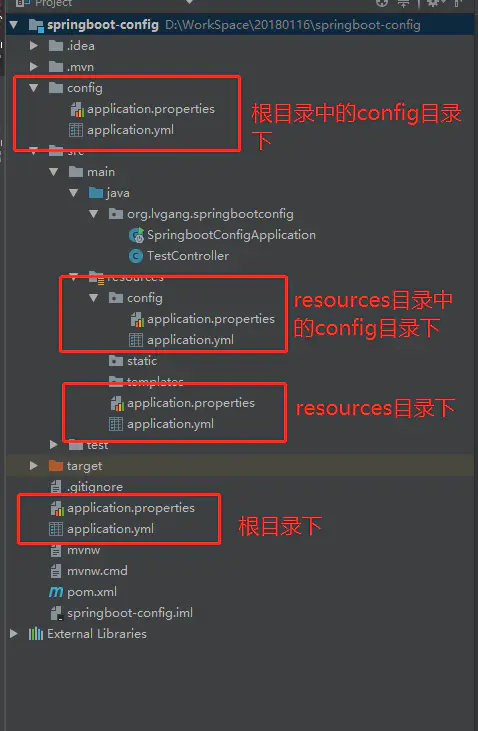

## 1.多数据源配置


参考：

1. [[SpringBoot实战]快速配置多数据源（整合MyBatis）](https://juejin.cn/post/6844903957186232327);

2.  [SpringBoot 的 MyBatis 多数据源配置](https://www.cnblogs.com/niumoo/p/14209663.html)；


## 2.application.yml与bootstrap.yml的区别

### 2.1 简述

Spring Boot 默认支持 `properties`(.properties) 和` YAML`(.yml、 .yaml ) 两种格式的配置文件，yml 和 properties 文件都属于配置文件，功能一样。

### 2.2 加载顺序

对于同一目录下的`application.yml`和`bootstrap.yml`，先加载的是 `bootstrap.yml`文件，后加载的是`application.yml`。 `bootstrap.yml`用于应用程序的引导阶段。bootstrap.yml 由父Spring ApplicationContext加载，而该父Spring ApplicationContext的加载是在加载`application.yml`的Spring ApplicationContext之前(That parent `ApplicationContext` is loaded before the one that uses `application.yml`.)。

### 2.3 配置区别

两者都可以用来进行参数的配置。

* `bootstrap.yml`在程序引导是执行，应用于早期配置信息读取，可以理解为系统级别的参数配置，这些参数一般是不会变动的。一旦`bootstrap.yml`加载完毕，内容不会被覆盖。
* `application.yml`主要是应用程序相关的配置信息，可以理解为应用级别的参数配置。

### 2.4 属性覆盖问题

启动上下文时，Spring Cloud 会创建一个 Bootstrap Context，作为 Spring 应用的 Application Context 的父上下文。

初始化的时候，Bootstrap Context 负责从外部源加载配置属性并解析配置。这两个上下文共享一个从外部获取的 Environment。Bootstrap 属性有高优先级，默认情况下，它们不会被本地配置覆盖。

也就是说如果加载的 `application.yml` 的内容标签与 bootstrap 的标签一致，application 也不会覆盖 bootstrap，而 `application.yml` 里面的内容可以动态替换。

### 2.5 应用场景

在Spring Cloud中，如果你使用的是`Spring Cloud Config Server `配置服务模块，那么对于相关属性`spring.application.name`及`spring.cloud.config.server.git.uri`应该在` bootstrap.yml`里配置。

技术上，`bootstrap.yml`是被一个父级的 Spring ApplicationContext 加载的。这个父级的 Spring ApplicationContext是先加载的，在加载`application.yml`的 ApplicationContext之前。

为什么要把`Spring Cloud Config Server`的相关配置信息放在`bootstrap.yml`文件里呢？

在 使用`Spring Cloud`框架时，配置信息一般是从 `Spring Cloud Config Server `模块加载的，为了取得配置信息（比如密码等），你需要一些提早的或引导配置。因此，把 `Spring Cloud Config Server `信息放在 `bootstrap.yml`，用来加载真正需要的配置信息。

`Spring Cloud Config Server `模块配置文件示例：

```
spring:
  application:
    name: dash-config
  cloud:
    config:
      server:
        # 本地配置文件位置，使用此配置项，还需要启用spring.profiles.active=native
        native:
          search-locations: C:/study/ddmit/dashcloud/dashcloud-config-files
        # git配置文件仓库配置
#        git:
#          uri: https://example.com/my/repo
#          skipSslValidation: true

```


参考：

1） [application.yml与bootstrap.yml的区别？](https://www.cnblogs.com/cy0628/p/15193872.html)

2）[What is the difference between putting a property on application.yml or bootstrap.yml in spring boot?](https://stackoverflow.com/questions/32997352/what-is-the-difference-between-putting-a-property-on-application-yml-or-bootstra)

## 3.配置文件不同位置的优先级？

配置文件结构图：




如果在不同的目录中存在多个配置文件，它的读取顺序是：

```
1.config/application.properties（项目根目录中config目录下）
2.config/application.yml
3.application.properties（项目根目录下）
4.application.yml
5.resources/config/application.properties（项目resources目录中config目录下）
6.resources/config/application.yml
7.resources/application.properties（项目的resources目录下）
8.resources/application.yml
```


