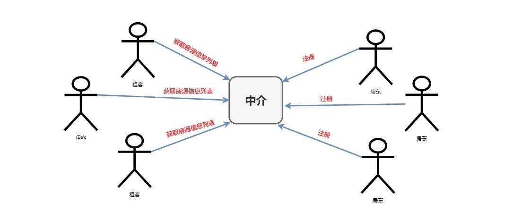
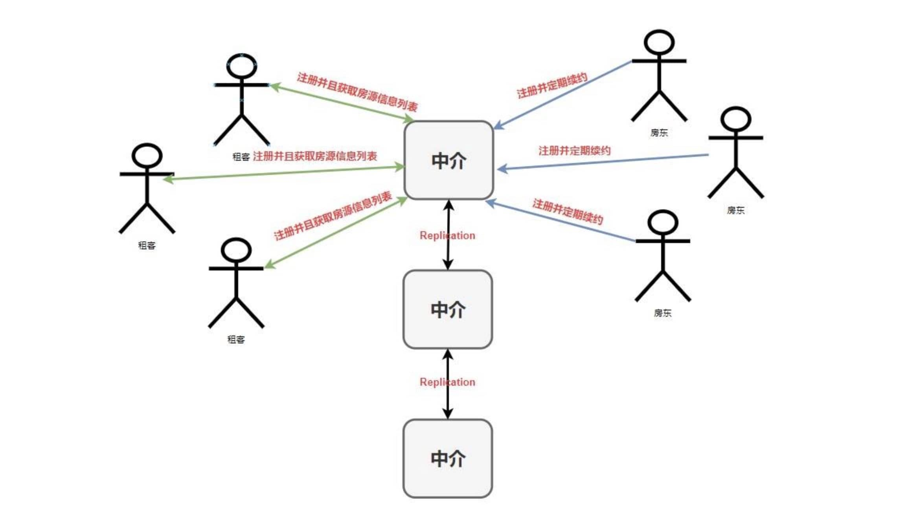
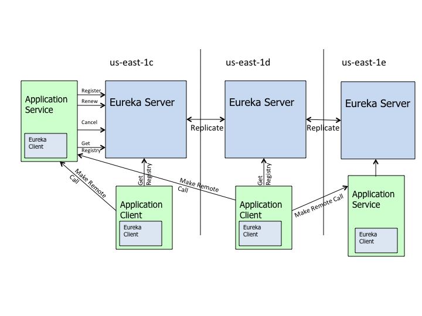
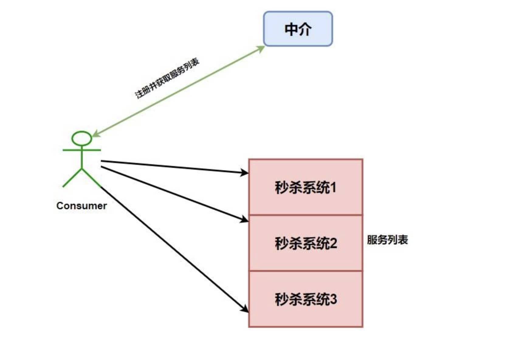
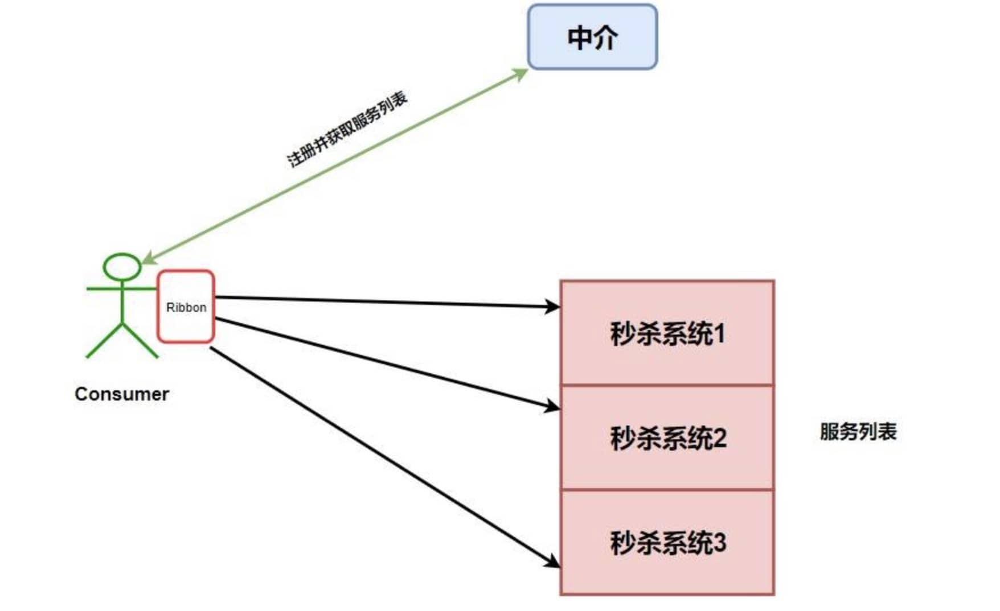
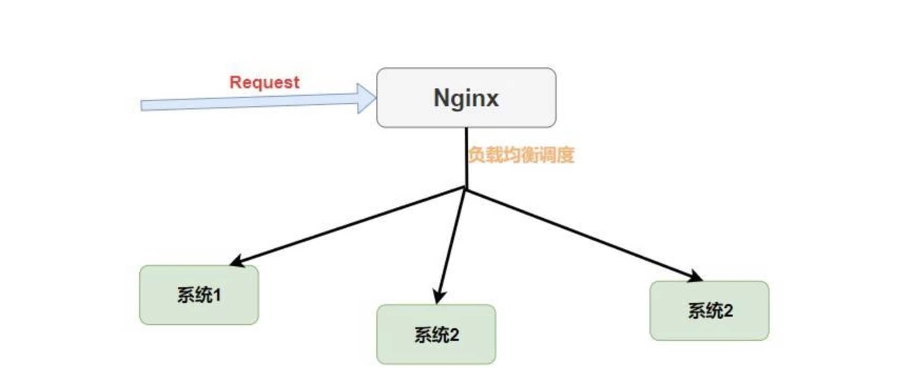
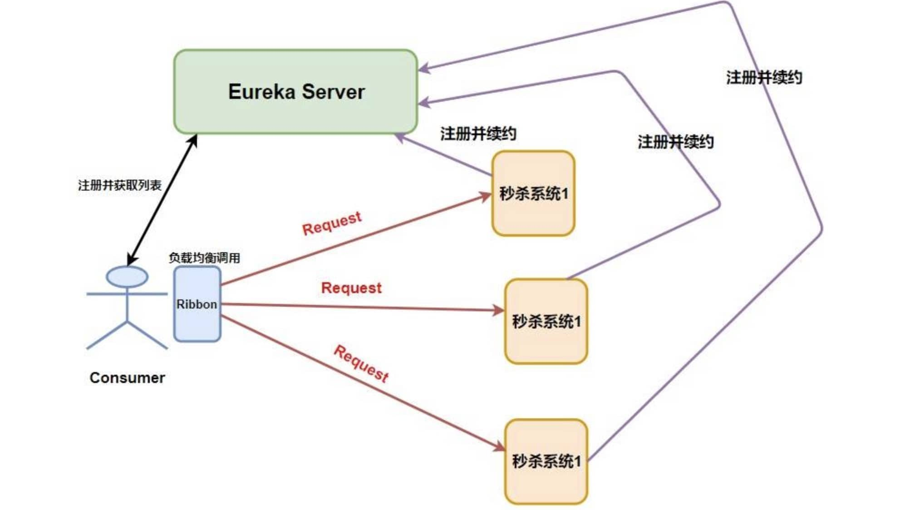

## 1.服务网关

### 1.1 基本介绍

* Spring Cloud Gateway

`Spring Cloud Gateway`是基于`Spring`生态系统之上构建的`API`网关，包括：`Spring 5.x`，`Spring Boot 2.x`和`Project Reactor`。`Spring Cloud Gateway`旨在提供一种简单而有效的方法来路由到`API`，并为它们提供跨领域的关注点，例如：`安全性`、`监视/指标`、`限流`等。

* 什么是服务网关

`API Gateway(APIGW/API网关)`，顾名思义，是系统对外的唯一入口。`API`网关封装了系统内部架构，为每个客户端提供定制的API。 近几年来移动应用与企业间互联需求的兴起。从以前单一的Web应用，扩展到多种使用场景，且每种使用场景对后台服务的要求都不尽相同。 这不仅增加了后台服务的响应量，还增加了后台服务的复杂性。随着微服务架构概念的提出，API网关成为了微服务架构的一个标配组件。

* 为什么要使用网关

微服务的应用可能部署在不同机房、不同地区、不同域名下。此时客户端（浏览器/手机/软件工具）想要请求对应的服务，都需要知道机器的具体IP或者域名URL，当微服务实例众多时，这是非常难以记忆的，对于客户端来说也太复杂难以维护。此时就有了网关，客户端相关的请求直接发送到网关，由网关根据请求标识解析判断出具体的微服务地址，再把请求转发到微服务实例。这其中的记忆功能就全部交由网关来操作了。

* 核心概念

`路由(Route)`: 路由是网关最基础的部分，路由信息由ID、目标URI、一组断言和一组过滤器组成。如果断言路由为真，则说明请求的URI和配置匹配。
`断言(Predicate)`: Java 8中的断言函数。Spring Cloud Gateway中的断言函数输入类型是Spring 5.0框架中的ServerWebExchange。Spring Cloud Gateway中的断言函数允许开发者去定义匹配来自于Http Request中的任何信息，比如请求头和参数等。
`过滤器(Filter)`: 一个标准的Spring Web Filter。Spring Cloud Gateway中的Filter分为两种类型，分别是Gateway Filter和Global Filter。过滤器将会对请求和响应进行处理。

### 1.2 使用网关

* 添加依赖

```
  <!-- spring cloud gateway 依赖 -->
  <dependency>
  	<groupId>org.springframework.cloud</groupId>
  	<artifactId>spring-cloud-starter-gateway</artifactId>
  </dependency>
```


* 配置文件`resources/application.yml`

```
  server:
    port: 8080
  
  spring: 
    application:
      name: ruoyi-gateway
    cloud:
      gateway:
        routes:
          # 系统模块
          - id: ruoyi-system
            uri: http://localhost:9201/
            predicates:
              - Path=/system/**
            filters:
              - StripPrefix=1
```
  
  
  
* 网关启动类

```
@SpringBootApplication
public class RuoYiGatewayApplication
{
    public static void main(String[] args)
    {
        SpringApplication.run(RuoYiGatewayApplication.class, args);
        System.out.println("(♥◠‿◠)ﾉﾞ  若依网关启动成功   ლ(´ڡ`ლ)ﾞ ");
    }
}
```
  
## 2.Eureka支撑高并发、高性能的原理

* Eureka通过设置适当的请求频率(拉取注册表30秒间隔，发送心跳30秒间隔)，可以保证一个大规模的系统每秒请求Eureka Server的次数在几百次;
* 同时通过纯内存的注册表，保证了所有的请求都可以在内存处理，确保了极高的性能;
* 多级缓存机制(只读缓存、读写缓存、实际注册表)，确保了不会针对内存数据结构发生频繁的读写并发冲突操作，进一步提升性能;

参考：

1. [eureka如何应对高并发？](https://blog.csdn.net/Sunxn1991/article/details/108393582)；
2. [Eureka支撑高并发、高性能的原理](https://whb1990.github.io/posts/2d8525f4.html)；


## 3.Spring Cloud的服务发现框架——Eureka

> `Eureka`是基于`REST`(代表性状态转移)的服务，主要在`AWS`云中用于定位服务，以实现负载均衡和中间层服务器的故障转移。我们称此服务为`Eureka`服务器。Eureka还带有一个基于`Java`的客户端组件`Eureka Client`，它使与服务的交互变得更加容易。客户端还具有一个内置的负载平衡器，可以执行基本的循环负载平衡。在`Netflix`，更复杂的负载均衡器将`Eureka`包装起来，以基于流量，资源使用，错误条件等多种因素提供加权负载均衡，以提供出色的弹性。

总的来说，`Eureka`就是一个服务发现框架。何为服务，何又为发现呢？

举一个生活中的例子，就比如我们平时租房子找中介的事情。

在没有中介的时候我们需要一个一个去寻找是否有房屋要出租的房东，这显然会非常的费力，凭一个人的能力是找不到很多房源供你选择，再者你也懒得这么找下去(找了这么久，没有合适的只能将就)。**这里的我们就相当于微服务中的`Consumer`，而那些房东就相当于微服务中的`Provider` 。消费者`Consumer`需要调用提供者`Provider`提供的一些服务，就像我们现在需要租他们的房子一样。**

但是如果只是租客和房东之间进行寻找的话，他们的效率是很低的，房东找不到租客赚不到钱，租客找不到房东住不了房。所以，后来房东肯定就想到了广播自己的房源信息(比如在街边贴贴小广告)，这样对于房东来说已经完成他的任务(将房源公布出去)，但是有两个问题就出现了。第一、其他不是租客的都能收到这种租房消息，这在现实世界没什么，但是在计算机的世界中就会出现**资源消耗** 的问题了。第二、租客这样还是很难找到你，试想一下我需要租房，我还需要东一个西一个地去找街边小广告，麻不麻烦？

那怎么办呢？我们当然不会那么傻乎乎的，第一时间就是去找**中介**呀，它为我们提供了统一房源的地方，我们消费者只需要跑到它那里去找就行了。而对于房东来说，他们也只需要把房源在中介那里发布就行了。


那么现在，我们的模式就是这样的了。



但是，这个时候还会出现一些问题。

1. 房东注册之后如果不想卖房子了怎么办？我们是不是需要让房东**定期续约**？如果房东不进行续约是不是要将他们从中介那里的注册列表中**移除**。
2. 租客是不是也要进行**注册**呢？不然合同乙方怎么来呢？
3. 中介可不可以做**连锁店**呢？如果这一个店因为某些不可抗力因素而无法使用，那么我们是否可以换一个连锁店呢？

针对上面的问题我们来重新构建一下上面的模式图



好了，举完这个:chestnut:我们就可以来看关于`Eureka`的一些基础概念了，你会发现这东西理解起来怎么这么简单。:punch::punch::punch:

**服务发现**：其实就是一个“中介”，整个过程中有三个角色：**服务提供者(出租房子的)、服务消费者(租客)、服务中介(房屋中介)**。

**服务提供者**： 就是提供一些自己能够执行的一些服务给外界。

**服务消费者**： 就是需要使用一些服务的“用户”。

**服务中介**： 其实就是服务提供者和服务消费者之间的“桥梁”，服务提供者可以把自己注册到服务中介那里，而服务消费者如需要消费一些服务(使用一些功能)就可以在服务中介中寻找注册在服务中介的服务提供者。

**服务注册Register**：

官方解释：当`Eureka`客户端向`Eureka Server`注册时，它提供自身的**元数据**，比如IP地址、端口，运行状况指示符URL，主页等。

结合中介理解：房东(提供者`Eureka Client Provider`)在中介(服务器`Eureka Server`)那里登记房屋的信息，比如面积，价格，地段等等(元数据 `metaData`)。

**服务续约Renew**：

官方解释：**`Eureka`客户会每隔30秒(默认情况下)发送一次心跳来续约**。 通过续约来告知`Eureka Server`该`Eureka` 客户仍然存在，没有出现问题。 正常情况下，如果`Eureka Server`在90秒没有收到`Eureka`客户的续约，它会将实例从其注册表中删除。

结合中介理解：房东(提供者`Eureka Client Provider`)定期告诉中介(服务器`Eureka Server`)我的房子还租(续约)，中介(服务器`Eureka Server`)收到之后继续保留房屋的信息。

**获取注册列表信息Fetch Registries**： 

官方解释：`Eureka`客户端从服务器获取注册表信息，并将其缓存在本地。客户端会使用该信息查找其他服务，从而进行远程调用。该注册列表信息定期（每30秒钟）更新一次。每次返回注册列表信息可能与`Eureka`客户端的缓存信息不同，`Eureka`客户端自动处理。如果由于某种原因导致注册列表信息不能及时匹配，`Eureka`客户端则会重新获取整个注册表信息。 `Eureka` 服务器缓存注册列表信息，整个注册表以及每个应用程序的信息进行了压缩，压缩内容和没有压缩的内容完全相同。`Eureka`客户端和`Eureka` 服务器可以使用JSON / XML格式进行通讯。在默认的情况下 `Eureka`客户端使用压缩`JSON`格式来获取注册列表的信息。

结合中介理解：租客(消费者`Eureka Client Consumer`)去中介(服务器`Eureka Server`)那里获取所有的房屋信息列表(客户端列表`Eureka Client List`)，而且租客为了获取最新的信息会定期向中介(服务器`Eureka Server`)那里获取并更新本地列表。

**服务下线Cancel**：

官方解释：Eureka客户端在程序关闭时向Eureka服务器发送取消请求。 发送请求后，该客户端实例信息将从服务器的实例注册表中删除。该下线请求不会自动完成，它需要调用以下内容：`DiscoveryManager.getInstance().shutdownComponent();`

结合中介理解：房东(提供者`Eureka Client Provider`) 告诉中介(服务器`Eureka Server`)我的房子不租了，中介之后就将注册的房屋信息从列表中剔除。

**服务剔除Eviction**：

官方解释：在默认的情况下，**当Eureka客户端连续90秒(3个续约周期)没有向Eureka服务器发送服务续约，即心跳，Eureka服务器会将该服务实例从服务注册列表删除**，即服务剔除。

结合中介理解：房东(提供者 `Eureka Client Provider`) 会定期联系中介(服务器`Eureka Server`)告诉他我的房子还租(续约)，如果中介(服务器`Eureka Server`)长时间没收到提供者的信息，那么中介会将他的房屋信息给下架(服务剔除)。

下面就是`Netflix`官方给出的`Eureka`架构图，你会发现和我们前面画的中介图别无二致。



当然，可以充当服务发现的组件有很多：`Zookeeper` 、`Consul` 、`Eureka` 等。

更多关于`Eureka`的知识(自我保护，初始注册策略等等)可以自己去官网查看，或者查看我的另一篇文章[深入理解 Eureka](<https://juejin.im/post/5dd497e3f265da0ba7718018>)。


## 4.分布式事务


[分布式事务，这一篇就够了](https://xiaomi-info.github.io/2020/01/02/distributed-transaction/)；

## 5.微服务与分布式的区别

微服务是将原来臃肿的项目拆分为多个模块，是对服务的拆分；分布式是将服务分别部署在不同的机器上；微服务和分布式作用的目标不同。

参考：

1. [深度解析springcloud分布式微服务的实现](http://ifeve.com/%E6%B7%B1%E5%BA%A6%E8%A7%A3%E6%9E%90springcloud%E5%88%86%E5%B8%83%E5%BC%8F%E5%BE%AE%E6%9C%8D%E5%8A%A1%E7%9A%84%E5%AE%9E%E7%8E%B0/) ；

## 6.负载均衡之 Ribbon

### 6.1 什么是`RestTemplate`?

不是讲`Ribbon`么？怎么扯到了`RestTemplate`了？你先别急，听我慢慢道来。

我不听我不听我不听:hear_no_evil::hear_no_evil::hear_no_evil:。

我就说一句！**`RestTemplate`是`Spring`提供的一个访问Http服务的客户端类**，怎么说呢？就是微服务之间的调用是使用的`RestTemplate` 。比如这个时候我们消费者B需要调用提供者A所提供的服务我们就需要这么写。如我下面的伪代码。

```java
@Autowired
private RestTemplate restTemplate;
// 这里是提供者A的ip地址，但是如果使用了 Eureka 那么就应该是提供者A的名称
private static final String SERVICE_PROVIDER_A = "http://localhost:8081";

@PostMapping("/judge")
public boolean judge(@RequestBody Request request) {
    String url = SERVICE_PROVIDER_A + "/service1";
    return restTemplate.postForObject(url, request, Boolean.class);
}
```
如果你对源码感兴趣的话，你会发现上面我们所讲的`Eureka`框架中的**注册**、**续约**等，底层都是使用的`RestTemplate` 。

### 6.2 为什么需要Ribbon？

`Ribbon`是`Netflix`公司的一个开源的负载均衡项目，是一个客户端/进程内负载均衡器，**运行在消费者端**。

我们再举个:chestnut:，比如我们设计了一个秒杀系统，但是为了整个系统的**高可用**，我们需要将这个系统做一个集群，而这个时候我们消费者就可以拥有多个秒杀系统的调用途径了，如下图。



如果这个时候我们没有进行一些**均衡操作** ，如果我们对`秒杀系统1`进行大量的调用，而另外两个基本不请求，就会导致`秒杀系统1` 崩溃，而另外两个就变成了傀儡，那么我们为什么还要做集群，我们高可用体现的意义又在哪呢？

所以`Ribbon`出现了，注意我们上面加粗的几个字——**运行在消费者端**。指的是，`Ribbon`是运行在消费者端的负载均衡器，如下图。



其工作原理就是`Consumer`端获取到了所有的服务列表之后，在其**内部**使用**负载均衡算法**，进行对多个系统的调用。

### 6.3 Nginx和Ribbon的对比

提到**负载均衡**就不得不提到大名鼎鼎的`Nignx`了，而和`Ribbon`不同的是，它是一种**集中式**的负载均衡器。

何为集中式呢？简单理解就是**将所有请求都集中起来，然后再进行负载均衡**。如下图。



我们可以看到`Nginx`是接收了所有的请求进行负载均衡的，而对于`Ribbon`来说它是在消费者端进行的负载均衡。如下图。



> 请注意`Request`的位置，在`Nginx`中请求是先进入负载均衡器，而在`Ribbon`中是先在客户端进行负载均衡才进行请求的。

### 6.4 Ribbon的几种负载均衡算法

负载均衡，不管`Nginx`还是`Ribbon`都需要其算法的支持，`Nginx`使用的是轮询和加权轮询算法。而在`Ribbon` 中有更多的负载均衡调度算法，其默认是使用的`RoundRobinRule`轮询策略。

* **`RoundRobinRule`**：轮询策略。`Ribbon`默认采用的策略。若经过一轮轮询没有找到可用的`provider`，其最多轮询10 轮。若最终还没有找到，则返回`null`。
* **`RandomRule`**: 随机策略，从所有可用的`provider`中随机选择一个。
* **`RetryRule`**: 重试策略。先按照`RoundRobinRule`策略获取`provider`，若获取失败，则在指定的时限内重试。默认的时限为500毫秒。

🐦🐦🐦 还有很多，这里不一一举:chestnut:了，你最需要知道的是默认轮询算法，并且可以更换默认的负载均衡算法，只需要在配置文件中做出修改就行。

```yaml
providerName:
  ribbon:
    NFLoadBalancerRuleClassName: com.netflix.loadbalancer.RandomRule
```

当然，在`Ribbon`中你还可以**自定义负载均衡算法**，你只需要实现`IRule`接口，然后修改配置文件或者自定义`Java Config`类。

## 7.什么是Open Feign

有了`Eureka`、`RestTemplate` 、`Ribbon`，我们就可以愉快地进行服务间的调用了，但是使用`RestTemplate`还是不方便，我们每次都要进行这样的调用。

```java
@Autowired
private RestTemplate restTemplate;
// 这里是提供者A的ip地址，但是如果使用了 Eureka 那么就应该是提供者A的名称
private static final String SERVICE_PROVIDER_A = "http://localhost:8081";

@PostMapping("/judge")
public boolean judge(@RequestBody Request request) {
    String url = SERVICE_PROVIDER_A + "/service1";
    // 是不是太麻烦了？？？每次都要 url、请求、返回类型的 
    return restTemplate.postForObject(url, request, Boolean.class);
}
```

这样每次都调用`RestRemplate`的`API`是否太麻烦，我能不能像**调用原来代码一样进行各个服务间的调用呢？**

:bulb::bulb::bulb:聪明的小朋友肯定想到了，那就用**映射**呀，就像域名和IP地址的映射。我们可以将被调用的服务代码映射到消费者端，这样我们就可以**“无缝开发”**啦。

>  `OpenFeign`也是运行在消费者端的，使用`Ribbon`进行负载均衡，所以`OpenFeign`直接内置了`Ribbon`。

在导入了`Open Feign`之后我们就可以进行愉快编写`Consumer`端代码了。

```java
// 使用 @FeignClient 注解来指定提供者的名字
@FeignClient(value = "eureka-client-provider")
public interface TestClient {
    // 这里一定要注意需要使用的是提供者那端的请求相对路径，这里就相当于映射了
    @RequestMapping(value = "/provider/xxx",
    method = RequestMethod.POST)
    CommonResponse<List<Plan>> getPlans(@RequestBody planGetRequest request);
}
```

然后我们在`Controller`就可以像原来调用`Service`层代码一样调用它了。

```java
@RestController
public class TestController {
    // 这里就相当于原来自动注入的 Service
    @Autowired
    private TestClient testClient;
    // controller 调用 service 层代码
    @RequestMapping(value = "/test", method = RequestMethod.POST)
    public CommonResponse<List<Plan>> get(@RequestBody planGetRequest request) {
        return testClient.getPlans(request);
    }
}
```